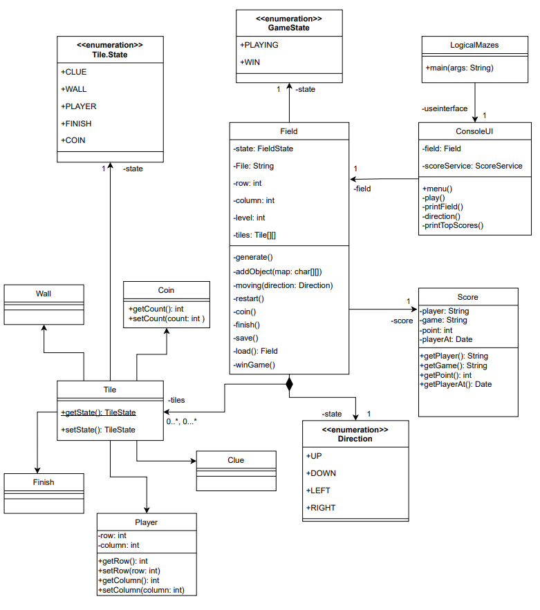
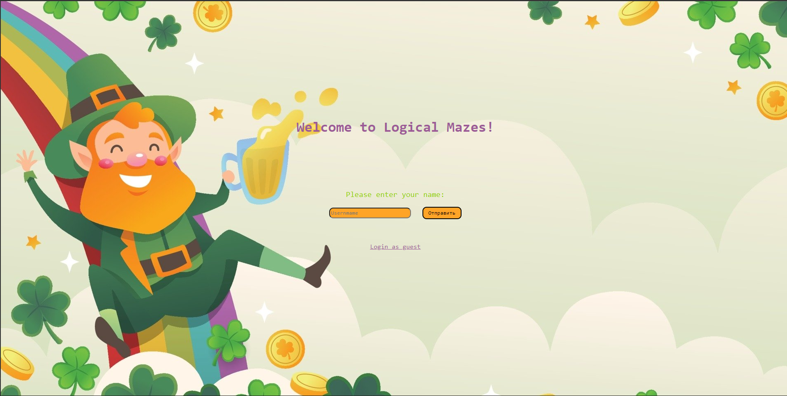
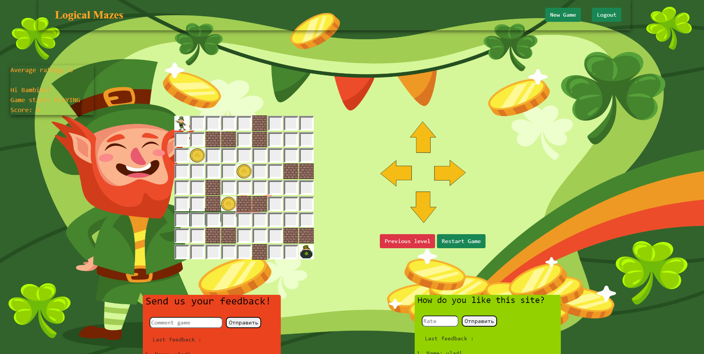
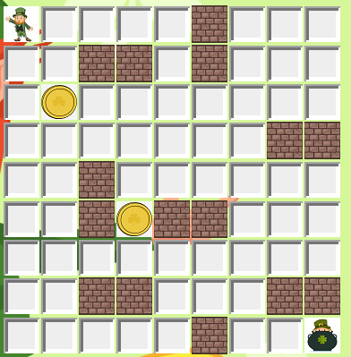
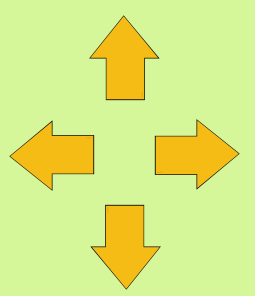
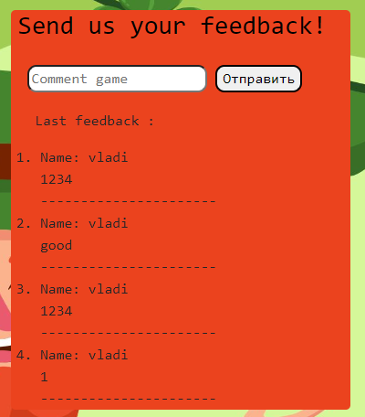
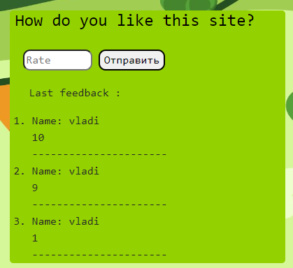
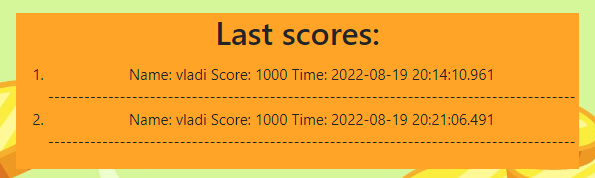

# Logical Mazes
Logic game where you have to go through the whole maze, collecting prizes along the way

- [x] Spring Boot


## Diagram



## Login page



## Game page



## Game map



## Player


## Coin


## Wall


## Clue


## Finish


##  Button for moving 



## Comment 


### CURL
```
curl --location --request POST 'http://localhost:8080/api/v1/comment' \
--header 'Content-Type: application/json' \
--data-raw '{
        "player": "vladi",
        "game": "mazes",
        "comment": "good",
        "commented_on": "time"
}'
```


## Rate


### CURL
```
curl --location --request POST 'http://localhost:8080/api/v1/rating' \
--header 'Content-Type: application/json' \
--data-raw '{
        "player": "vladi",
        "game": "mazes",
        "rating": "10",
        "rated_on": "time"
}'
```

## History Score


### CURL
```
curl --location --request POST 'http://localhost:8080/api/v1/score' \
--header 'Content-Type: application/json' \
--data-raw '{
        "player": "vladi",
        "game": "mazes",
        "point": "1000",
        "player_at": "time"
}'
```
